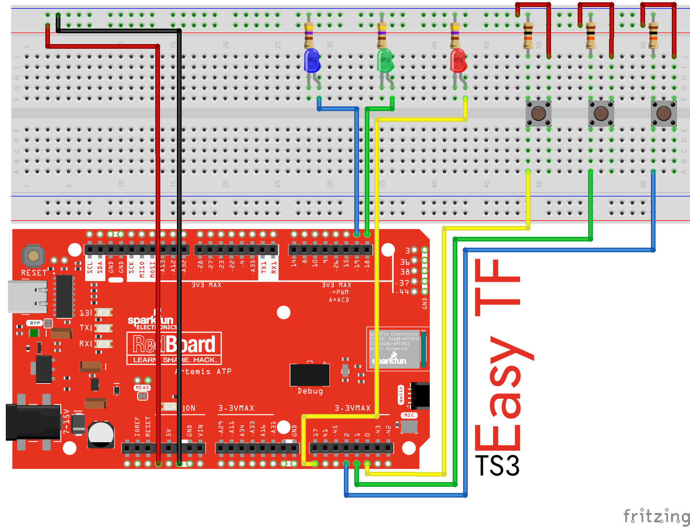

 

# Easy Tensorflow Lite
A much simpler approach to the basics of implementing machine learning on microcontrollers, specifically Arduino. This strips away most of the extra information when training and running a model in a microcontroller environment. It is also meant to simplify machine learning down to a basic example: number mapping.

- [Easy Tensorflow Lite](#easy-tensorflow-lite)
  - [Tested boards](#tested-boards)
  - [Circuit](#circuit)
  - [Usage](#usage)
    - [Programming Knowledge](#programming-knowledge)
      - [Python](#python)
      - [C++](#c)
    - [Training the Model](#training-the-model)
    - [Transferring to Project](#transferring-to-project)
    - [PlatformIO Setup](#platformio-setup)
  - [Other Examples](#other-examples)
  - [Credits](#credits)
    - [Libraries/Examples](#librariesexamples)
  - [Additional Resources](#additional-resources)
  - [License](#license)

## Tested boards
- SparkFun RedBoard ATP
- Adafruit Grand Central M4

*Both of these boards use the same or similar MCUs which have been tested by Tensorflow to be compatible with the Tensorflow library. More information about Tensorflow tested boards can be found [here](https://www.tensorflow.org/lite/microcontrollers).*

## Circuit

This circuit is one of the simplest examples of machine learning. It takes in a button input and outputs to a corresponding LED. This model is designed such that 0 corresponds to 1, 1 to 2, and 2 to 0. While this could be accomplished by much simpler methods, it is intended to be an easier start into training, exporting, loading, and debugging a custom Tensorflow model.

*This is not intended to be a full delve into Tensorflow Lite or TinyML in general. This is meant to be a simple, straightforward example of Tensorflow with no extras.*

## Usage
### Programming Knowledge
While full understanding is not required, it is **highly** recommended to have some knowledge on these topics
#### Python
- Library knowledge
  - Tensorflow
    - Setting up and training a Keras model
    - Utilizing the docs - What is shown here does not scratch the surface of Tensorflow's capabilities, the docs have almost all the info you could need 
  - Pandas
    - Data manipulation
  - Numpy
    - Focus especially on arrays
  - Matplot
    - While not used much in the model here to maintain simplicity, this is utilized **heavily** in machine learning
- Other Knowledge
  - Google Colab
    - Colab is the primary platform to train models on
    - Comfort navigating and working with importing and exporting files
  - Importing and installing libraries
#### C++
Required once the model is created to allow it to run on microcontrollers
- Libraries Knowledge
  - Tensorflow
    - Working with loading, allotting, instantiating, and debugging
  - Arduino
    - General board IO
- Other Knowledge
    - C++ Classes - It is important to understand how they work and how to implement them

### Training the Model 
Upload [Easy Tensorflow Lite Colab.ipynb](Python/Easy%20Tensorflow%20Lite%20Colab.ipynb) to your Google Drive and open it. From there you either view the original output or run it to create a new model.

### Transferring to Project
Copying the output bytes and the length of the buffer to [simple_model_data.cc](C++/lib/simple_model_data/simple_model_data.cc) in the corresponding locations will allow you to run your own model.

### PlatformIO Setup
To get the SparkFun Artemis boards installed into PlatformIO, follow the instructions on this [repository](https://github.com/nigelb/platform-apollo3blue). *Note that on Windows you **cannot** use the platformio command. You must copy the path to the PlatformIO exe file and use that instead*

*Notes as of writing this:
1. The path to the project must not contain any spaces to compile correctly
2. Projects must be created from the terminal to generate the proper files
3. The condition `upload_speed = ` must be added to the project INI file, `921600` works
4. To compile without a connected board, add `upload_port = ` to the project INI file
5. A model can convert without errors but not work on a microcontroller due to incorrect conversion parameters; this will often result in a large number that will often overflow

## Other Examples
I have also included an example that uses only the serial monitor in the event the breadboard supplies above are not available. It allows for input from the serial monitor and the microcontroller echos back the prediction. It can be found under [/Other Examples](Other%20Examples/tflite_serial_example.cpp).

## Credits
### Libraries/Examples
- Condensed Tensorflow Lite library and code references from [wezleysherman](https://github.com/wezleysherman/ESP32-TensorFlow-Lite-Sample)
- As stated above, SparkFun Artemis PlatformIO support from [nigelb](https://github.com/nigelb/platform-apollo3blue)
- Reference for converting models to TFLite models from [tensorflow](https://github.com/tensorflow/tensorflow/tree/master/tensorflow/lite/micro/examples/hello_world/train)

## Additional Resources
- [Udemy course](https://www.udemy.com/course/deep-learning-tensorflow-2/) I used to learn Tensorflow
- [SparkFun Artemis ATP board](https://www.sparkfun.com/products/15442)
- [Adafruit Grand Central M4](https://www.adafruit.com/product/4064)

## License
[GPL-3.0](https://choosealicense.com/licenses/gpl-3.0/)

This software is distributed on an "AS IS" BASIS, WITHOUT WARRANTIES OR CONDITIONS OF ANY KIND, either express or implied.